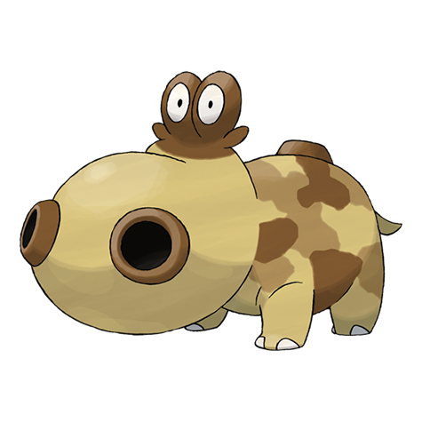

# Hippopotas (#0449)

*Hippo Pokemon*

**Type:** Terra
**Abilities:** [[Sand Stream]], [[Sand Force]] *(Hidden)*
**Base HP:** 3

> It lives in arid places where it joins small groups. It closes its nostrils and submerges under the sand to rest. Females have a different coloration, usually a darker and duller color.

---

## Statistiche (Attributes & Limits)

| Attribute | Base / Limit |
|---|---|
| **Strength** | 2/5 |
| **Dexterity** | 1/3 |
| **Vitality** | 2/5 |
| **Special** | 1/3 |
| **Insight** | 1/3 |

---

## Mosse (Learnset)

- **Starter:** [[Tackle|Tackle]], [[Sand_Attack|Sand Attack]]
- **Beginner:** [[Bite|Bite]], [[Yawn|Yawn]]
- **Amateur:** [[Take_Down|Take Down]], [[Dig|Dig]], [[Sand_Tomb|Sand Tomb]], [[Crunch|Crunch]]
- **Ace:** [[Earthquake|Earthquake]], [[Double_Edge|Double-Edge]], [[Fissure|Fissure]]
- **Pro:** [[Stockpile|Stockpile]], [[Slack_Off|Slack Off]], [[Water_Pulse|Water Pulse]]

---

## Correlati

### Catena Evolutiva
- [[0449_Hippopotas|Hippopotas]]
- [[0450_Hippowdon|Hippowdon]]
