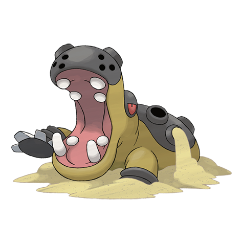

# Hippowdon (#0450)

*Heavyweight Pokemon*

**Type:** Terra
**Abilities:** [[Sand Stream]], [[Sand Force]] *(Hidden)*
**Base HP:** 5

> It becomes territorial and aggressive after evolving. Its open mouth stands over 7 ft. tall. There are records of one that came out of the sand and crushed a truck that was passing over its territory.

---

## Statistiche (Attributes & Limits)

| Attribute | Base / Limit |
|---|---|
| **Strength** | 3/6 |
| **Dexterity** | 2/4 |
| **Vitality** | 3/6 |
| **Special** | 2/4 |
| **Insight** | 2/5 |

---

## Mosse (Learnset)

- **Starter:** [[Sand_Attack|Sand Attack]], [[Tackle|Tackle]]
- **Beginner:** [[Yawn|Yawn]], [[Bite|Bite]]
- **Amateur:** [[Ice_Fang|Ice Fang]], [[Fire_Fang|Fire Fang]], [[Thunder_Fang|Thunder Fang]], [[Take_Down|Take Down]], [[Dig|Dig]], [[Sand_Tomb|Sand Tomb]], [[Crunch|Crunch]]
- **Ace:** [[Earthquake|Earthquake]], [[Double_Edge|Double-Edge]], [[Fissure|Fissure]]
- **Pro:** [[Slack_Off|Slack Off]], [[Iron_Head|Iron Head]], [[Revenge|Revenge]]

---

## Correlati

### Catena Evolutiva
- [[0449_Hippopotas|Hippopotas]]
- [[0450_Hippowdon|Hippowdon]]
