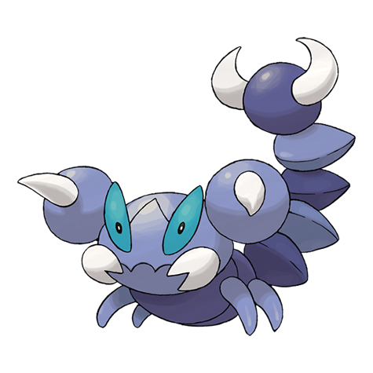

# Skorupi (#0451)

*Scorpion Pokemon*

**Type:** Veleno / Insetto
**Abilities:** [[Battle Armor]], [[Sniper]], [[Keen Eye]] *(Hidden)*
**Base HP:** 3

> It lives in deserts and arid regions. It buries itself under the sand, waiting for an unsuspecting prey to come nearby. It will then sting the prey and cling to it tenaciously until the poison takes effect.

---

## Statistiche (Attributes & Limits)

| Attribute | Base / Limit |
|---|---|
| **Strength** | 2/4 |
| **Dexterity** | 2/4 |
| **Vitality** | 2/5 |
| **Special** | 1/3 |
| **Insight** | 2/4 |

---

## Mosse (Learnset)

- **Starter:** [[Bite|Bite]], [[Poison_Sting|Poison Sting]], [[Leer|Leer]]
- **Beginner:** [[Knock_Off|Knock Off]], [[Pin_Missile|Pin Missile]]
- **Amateur:** [[Acupressure|Acupressure]], [[Pursuit|Pursuit]], [[Bug_Bite|Bug Bite]], [[Poison_Fang|Poison Fang]], [[Venoshock|Venoshock]], [[Hone_Claws|Hone Claws]], [[Toxic_Spikes|Toxic Spikes]]
- **Ace:** [[Night_Slash|Night Slash]], [[Scary_Face|Scary Face]], [[Crunch|Crunch]], [[Fell_Stinger|Fell Stinger]], [[Cross_Poison|Cross Poison]]
- **Pro:** [[Agility|Agility]], [[Aqua_Tail|Aqua Tail]], [[Poison_Tail|Poison Tail]]

---

## Correlati

### Catena Evolutiva
- [[0451_Skorupi|Skorupi]]
- [[0452_Drapion|Drapion]]
