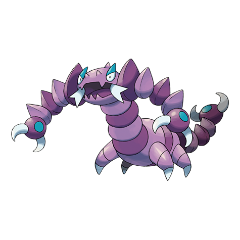

# Drapion (#0452)

*Ogre Scorp Pokemon*

**Type:** Veleno / Buio
**Abilities:** [[Battle Armor]], [[Sniper]], [[Keen Eye]] *(Hidden)*
**Base HP:** 4

> This Pokemon is very aggressive. It can completely rotate its head over its body, because of this, Drapion has no blind spots. Its venom is deadly and it won’t hesitate to use it.

---

## Statistiche (Attributes & Limits)

| Attribute | Base / Limit |
|---|---|
| **Strength** | 2/5 |
| **Dexterity** | 3/6 |
| **Vitality** | 3/6 |
| **Special** | 2/4 |
| **Insight** | 2/5 |

---

## Mosse (Learnset)

- **Starter:** [[Leer|Leer]], [[Bite|Bite]], [[Poison_Sting|Poison Sting]]
- **Beginner:** [[Pin_Missile|Pin Missile]], [[Knock_Off|Knock Off]]
- **Amateur:** [[Ice_Fang|Ice Fang]], [[Fire_Fang|Fire Fang]], [[Thunder_Fang|Thunder Fang]], [[Acupressure|Acupressure]], [[Pursuit|Pursuit]], [[Bug_Bite|Bug Bite]], [[Poison_Fang|Poison Fang]], [[Venoshock|Venoshock]], [[Hone_Claws|Hone Claws]], [[Toxic_Spikes|Toxic Spikes]]
- **Ace:** [[Night_Slash|Night Slash]], [[Scary_Face|Scary Face]], [[Crunch|Crunch]], [[Fell_Stinger|Fell Stinger]], [[Cross_Poison|Cross Poison]]
- **Pro:** [[Agility|Agility]], [[Aqua_Tail|Aqua Tail]], [[Poison_Tail|Poison Tail]]

---

## Correlati

### Catena Evolutiva
- [[0451_Skorupi|Skorupi]]
- [[0452_Drapion|Drapion]]
