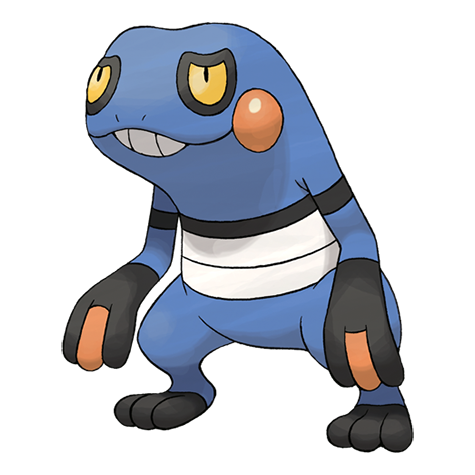

# Croagunk (#0453)

*Toxic Mouth Pokemon*

**Type:** Veleno / Lotta
**Abilities:** [[Anticipation]], [[Dry Skin]], [[Poison Touch]] *(Hidden)*
**Base HP:** 3

> It is commonly found in marshes. It inflates the sacks on its cheeks and makes croaking sounds. The fluid squeezed from its fingers is poisonous, but it is a common ingredient in medicinal ointments.

---

## Statistiche (Attributes & Limits)

| Attribute | Base / Limit |
|---|---|
| **Strength** | 2/4 |
| **Dexterity** | 2/4 |
| **Vitality** | 1/3 |
| **Special** | 2/4 |
| **Insight** | 1/3 |

---

## Mosse (Learnset)

- **Starter:** [[Astonish|Astonish]], [[Mud_Slap|Mud Slap]]
- **Beginner:** [[Poison_Sting|Poison Sting]], [[Taunt|Taunt]]
- **Amateur:** [[Pursuit|Pursuit]], [[Feint_Attack|Feint Attack]], [[Revenge|Revenge]], [[Swagger|Swagger]], [[Mud_Bomb|Mud Bomb]], [[Sucker_Punch|Sucker Punch]], [[Venoshock|Venoshock]], [[Nasty_Plot|Nasty Plot]]
- **Ace:** [[Poison_Jab|Poison Jab]], [[Sludge_Bomb|Sludge Bomb]], [[Belch|Belch]], [[Flatter|Flatter]]
- **Pro:** [[Fake_Out|Fake Out]], [[Drain_Punch|Drain Punch]], [[Quick_Guard|Quick Guard]]

---

## Correlati

### Catena Evolutiva
- [[0453_Croagunk|Croagunk]]
- [[0454_Toxicroak|Toxicroak]]
