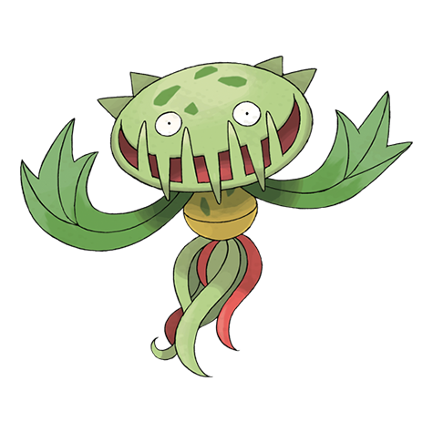

# Carnivine (#0455)

*Bug Catcher Pokemon*

**Type:** Erba
**Abilities:** [[Levitate]]
**Base HP:** 4

> It binds itself to trees in marshes. It attracts prey with its sweet-smelling drool and gulps them down in one bite. It can take it a whole day to digest a single prey but It won’t need to eat for at least a week.

---

## Statistiche (Attributes & Limits)

| Attribute | Base / Limit |
|---|---|
| **Strength** | 3/6 |
| **Dexterity** | 2/4 |
| **Vitality** | 2/5 |
| **Special** | 2/5 |
| **Insight** | 2/5 |

---

## Mosse (Learnset)

- **Starter:** [[Bind|Bind]], [[Growth|Growth]]
- **Beginner:** [[Bite|Bite]], [[Vine_Whip|Vine Whip]]
- **Amateur:** [[Sweet_Scent|Sweet Scent]], [[Ingrain|Ingrain]], [[Feint_Attack|Feint Attack]], [[Leaf_Tornado|Leaf Tornado]], [[Stockpile|Stockpile]], [[Spit_Up|Spit Up]], [[Swallow|Swallow]]
- **Ace:** [[Crunch|Crunch]], [[Wring_Out|Wring Out]], [[Power_Whip|Power Whip]]
- **Pro:** [[Rage_Powder|Rage Powder]], [[Gastro_Acid|Gastro Acid]], [[Seed_Bomb|Seed Bomb]]

---

