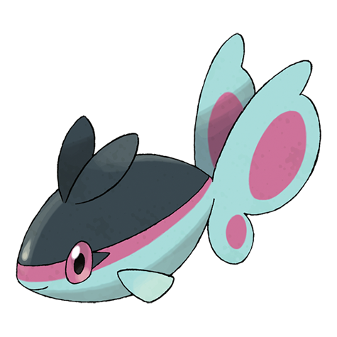

# Finneon (#0456)

*Wing Fish Pokemon*

**Type:** Acqua
**Abilities:** [[Swift Swim]], [[Storm Drain]], [[Water Veil]] *(Hidden)*
**Base HP:** 3

> The way its two-tail-fins flutter while it swims has earned Finneon the nickname “Beautifly of the Sea.” The line running down its side can store sunlight and glow brightly at night.

---

## Statistiche (Attributes & Limits)

| Attribute | Base / Limit |
|---|---|
| **Strength** | 2/4 |
| **Dexterity** | 2/4 |
| **Vitality** | 2/4 |
| **Special** | 2/4 |
| **Insight** | 2/4 |

---

## Mosse (Learnset)

- **Starter:** [[Pound|Pound]]
- **Beginner:** [[Water_Gun|Water Gun]], [[Attract|Attract]]
- **Amateur:** [[Rain_Dance|Rain Dance]], [[Gust|Gust]], [[Water_Pulse|Water Pulse]], [[Captivate|Captivate]], [[Safeguard|Safeguard]], [[Aqua_Ring|Aqua Ring]], [[Whirlpool|Whirlpool]]
- **Ace:** [[U_Turn|U-Turn]], [[Bounce|Bounce]], [[Silver_Wind|Silver Wind]], [[Soak|Soak]]
- **Pro:** [[Agility|Agility]], [[Sweet_Kiss|Sweet Kiss]], [[Aurora_Beam|Aurora Beam]]

---

## Correlati

### Catena Evolutiva
- [[0456_Finneon|Finneon]]
- [[0457_Lumineon|Lumineon]]
