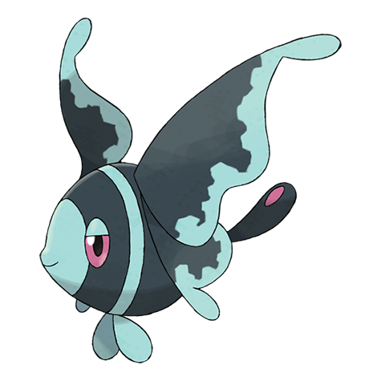

# Lumineon (#0457)

*Neon Pokemon*

**Type:** Acqua
**Abilities:** [[Swift Swim]], [[Storm Drain]], [[Water Veil]] *(Hidden)*
**Base HP:** 4

> It lives in the deep-sea bottom. It attracts prey by flashing the patterns on its tail fins. In the wild it competes against Lanturn for food. Its main predators are Tentacruel and Sharpedo.

---

## Statistiche (Attributes & Limits)

| Attribute | Base / Limit |
|---|---|
| **Strength** | 2/5 |
| **Dexterity** | 2/5 |
| **Vitality** | 2/5 |
| **Special** | 2/5 |
| **Insight** | 2/5 |

---

## Mosse (Learnset)

- **Starter:** [[Pound|Pound]]
- **Beginner:** [[Water_Gun|Water Gun]], [[Attract|Attract]]
- **Amateur:** [[Gust|Gust]], [[Rain_Dance|Rain Dance]], [[Water_Pulse|Water Pulse]], [[Captivate|Captivate]], [[Safeguard|Safeguard]], [[Aqua_Ring|Aqua Ring]], [[Whirlpool|Whirlpool]]
- **Ace:** [[U_Turn|U-Turn]], [[Bounce|Bounce]], [[Silver_Wind|Silver Wind]], [[Soak|Soak]]
- **Pro:** [[Agility|Agility]], [[Brine|Brine]], [[Aurora_Beam|Aurora Beam]]

---

## Correlati

### Catena Evolutiva
- [[0456_Finneon|Finneon]]
- [[0457_Lumineon|Lumineon]]
