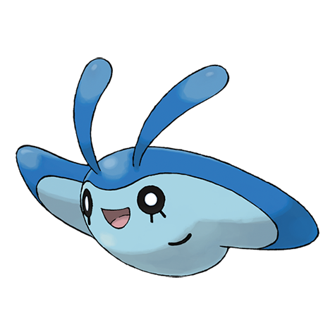

# Mantyke (#0458)

*Kite Pokemon*

**Type:** Acqua / Volante
**Abilities:** [[Swift Swim]], [[Water Absorb]], [[Water Veil]] *(Hidden)*
**Base HP:** 3

> When it swims close the ocean’s surface people aboard ships are able to observe the pattern on its back as it is different in every region. Mantyke is an intelligent and friendly Pokemon that rarely attacks others.

---

## Statistiche (Attributes & Limits)

| Attribute | Base / Limit |
|---|---|
| **Strength** | 1/3 |
| **Dexterity** | 2/4 |
| **Vitality** | 2/4 |
| **Special** | 1/3 |
| **Insight** | 3/6 |

---

## Mosse (Learnset)

- **Starter:** [[Tackle|Tackle]], [[Bubble|Bubble]]
- **Beginner:** [[Supersonic|Supersonic]], [[Bubble_Beam|Bubble Beam]], [[Confuse_Ray|Confuse Ray]]
- **Amateur:** [[Wing_Attack|Wing Attack]], [[Headbutt|Headbutt]], [[Water_Pulse|Water Pulse]], [[Wide_Guard|Wide Guard]], [[Take_Down|Take Down]], [[Agility|Agility]]
- **Ace:** [[Air_Slash|Air Slash]], [[Aqua_Ring|Aqua Ring]], [[Bounce|Bounce]], [[Hydro_Pump|Hydro Pump]]
- **Pro:** [[Twister|Twister]], [[Helping_Hand|Helping Hand]], [[Tailwind|Tailwind]]

---

## Correlati

### Catena Evolutiva
- [[0458_Mantyke|Mantyke]]
- [[0226_Mantine|Mantine]]
