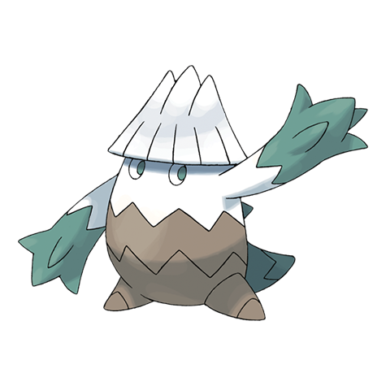

# Snover (#0459)

*Frosted Tree Pokemon*

**Type:** Erba / Ghiaccio
**Abilities:** [[Snow Warning]], [[Soundproof]] *(Hidden)*
**Base HP:** 3

> During cold seasons, it migrates to the mountain’s lower reaches and returns to the summit in the spring. They are rarely in contact with humans but are sought for the frozen berries they grow.

---

## Statistiche (Attributes & Limits)

| Attribute | Base / Limit |
|---|---|
| **Strength** | 2/4 |
| **Dexterity** | 1/3 |
| **Vitality** | 2/4 |
| **Special** | 2/4 |
| **Insight** | 2/4 |

---

## Mosse (Learnset)

- **Starter:** [[Powder_Snow|Powder Snow]], [[Leer|Leer]]
- **Beginner:** [[Razor_Leaf|Razor Leaf]], [[Icy_Wind|Icy Wind]]
- **Amateur:** [[Grass_Whistle|Grass Whistle]], [[Swagger|Swagger]], [[Mist|Mist]], [[Ice_Shard|Ice Shard]], [[Ingrain|Ingrain]]
- **Ace:** [[Wood_Hammer|Wood Hammer]], [[Blizzard|Blizzard]], [[Sheer_Cold|Sheer Cold]]
- **Pro:** [[Growth|Growth]], [[Seed_Bomb|Seed Bomb]], [[Water_Pulse|Water Pulse]]

---

## Correlati

### Catena Evolutiva
- [[0459_Snover|Snover]]
- [[0460_Abomasnow|Abomasnow]]
- Abomasnow (Mega Form)
