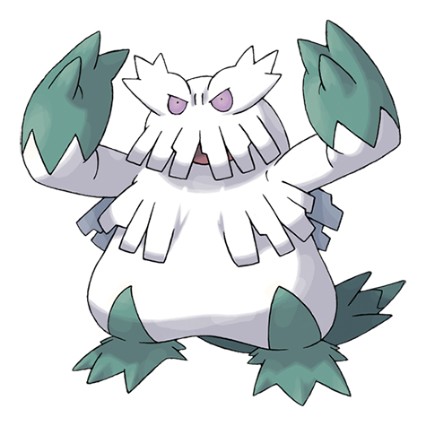

# Abomasnow (Mega Form) (#0460M1)

*Frosted Tree Pokemon*

**Type:** Erba / Ghiaccio
**Abilities:** [[Snow Warning]]
**Base HP:** 5

> The power of the Mega Stone freezes part of its body creating pointy icicles that hail upon its enemies in a blizzard. The angrier it becomes the longer the storm will last.

---

## Statistiche (Attributes & Limits)

| Attribute | Base / Limit |
|---|---|
| **Strength** | 3/7 |
| **Dexterity** | 1/2 |
| **Vitality** | 3/6 |
| **Special** | 3/7 |
| **Insight** | 3/6 |

---

## Mosse (Learnset)

- **Starter:** [[Leer|Leer]], [[Powder_Snow|Powder Snow]]
- **Beginner:** [[Ice_Punch|Ice Punch]], [[Razor_Leaf|Razor Leaf]], [[Icy_Wind|Icy Wind]]
- **Amateur:** [[Grass_Whistle|Grass Whistle]], [[Swagger|Swagger]], [[Mist|Mist]], [[Ice_Shard|Ice Shard]], [[Ingrain|Ingrain]]
- **Ace:** [[Wood_Hammer|Wood Hammer]], [[Blizzard|Blizzard]], [[Sheer_Cold|Sheer Cold]]
- **Pro:** [[Growth|Growth]], [[Avalanche|Avalanche]], [[Outrage|Outrage]]

---
