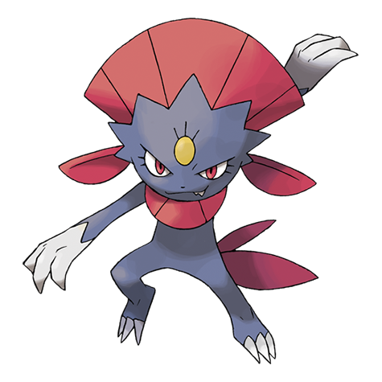

# Weavile (#0461)

*Sharp Claw Pokemon*

**Type:** Buio / Ghiaccio
**Abilities:** [[Pressure]], [[Pickpocket]] *(Hidden)*
**Base HP:** 4

> They live in cold regions, forming groups of four that hunt prey with impressive coordination. They leave claw marks and patterns to indicate their territory. It is devious and loves to cause trouble.

---

## Statistiche (Attributes & Limits)

| Attribute | Base / Limit |
|---|---|
| **Strength** | 3/7 |
| **Dexterity** | 3/7 |
| **Vitality** | 2/4 |
| **Special** | 2/4 |
| **Insight** | 2/5 |

---

## Mosse (Learnset)

- **Starter:** [[Leer|Leer]], [[Scratch|Scratch]], [[Taunt|Taunt]]
- **Beginner:** [[Feint_Attack|Feint Attack]], [[Embargo|Embargo]], [[Quick_Attack|Quick Attack]]
- **Amateur:** [[Assurance|Assurance]], [[Revenge|Revenge]], [[Icy_Wind|Icy Wind]], [[Fury_Swipes|Fury Swipes]], [[Nasty_Plot|Nasty Plot]], [[Metal_Claw|Metal Claw]], [[Hone_Claws|Hone Claws]], [[Fling|Fling]], [[Screech|Screech]], [[Night_Slash|Night Slash]]
- **Ace:** [[Snatch|Snatch]], [[Punishment|Punishment]], [[Dark_Pulse|Dark Pulse]]
- **Pro:** [[Icicle_Crash|Icicle Crash]], [[Fake_Out|Fake Out]], [[Low_Kick|Low Kick]]

---

