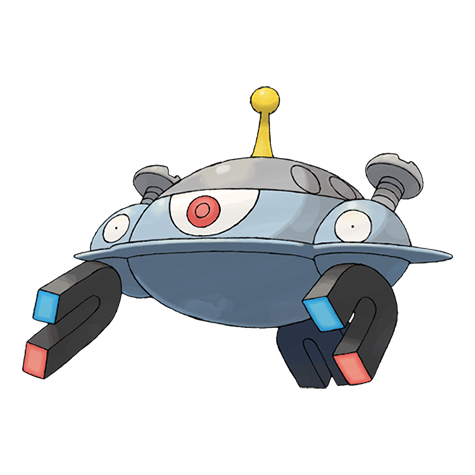

# Magnezone (#0462)

*Magnet Area Pokemon*

**Type:** Elettro / Acciaio
**Abilities:** [[Magnet Pull]], [[Sturdy]], [[Analytic]] *(Hidden)*
**Base HP:** 5

> Magneton only evolves in very specific areas of the globe. It has the ability to repel itself from the ground using magnetism. If it is nervous it pulls all the pieces of metal around until it relaxes.

---

## Statistiche (Attributes & Limits)

| Attribute | Base / Limit |
|---|---|
| **Strength** | 2/5 |
| **Dexterity** | 2/4 |
| **Vitality** | 3/6 |
| **Special** | 3/7 |
| **Insight** | 2/5 |

---

## Mosse (Learnset)

- **Starter:** [[Supersonic|Supersonic]], [[Tackle|Tackle]], [[Sonic_Boom|Sonic Boom]]
- **Beginner:** [[Magnetic_Flux|Magnetic Flux]], [[Thunder_Shock|Thunder Shock]], [[Electric_Terrain|Electric Terrain]]
- **Amateur:** [[Flash_Cannon|Flash Cannon]], [[Screech|Screech]], [[Thunder_Wave|Thunder Wave]], [[Magnet_Bomb|Magnet Bomb]], [[Spark|Spark]], [[Mirror_Shot|Mirror Shot]], [[Metal_Sound|Metal Sound]], [[Electro_Ball|Electro Ball]]
- **Ace:** [[Barrier|Barrier]], [[Mirror_Coat|Mirror Coat]], [[Discharge|Discharge]], [[Lock_On|Lock-On]], [[Magnet_Rise|Magnet Rise]], [[Gyro_Ball|Gyro Ball]], [[Zap_Cannon|Zap Cannon]]
- **Pro:** [[Iron_Defense|Iron Defense]], [[Gravity|Gravity]], [[Signal_Beam|Signal Beam]]

---

