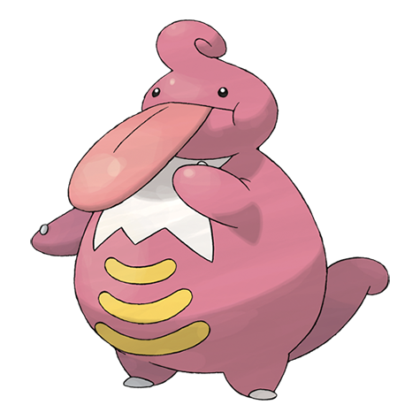

# Lickilicky (#0463)

*Licking Pokemon*

**Type:** Normale
**Abilities:** [[Own Tempo]], [[Oblivious]], [[Cloud Nine]] *(Hidden)*
**Base HP:** 5

> It uses its tongue as an stretchable arm. It will wrap prey with it and then proceed to eat it. Its saliva causes numbness. Try not to touch its tongue, it might try to eat you by reflex.

---

## Statistiche (Attributes & Limits)

| Attribute | Base / Limit |
|---|---|
| **Strength** | 2/5 |
| **Dexterity** | 2/4 |
| **Vitality** | 3/6 |
| **Special** | 2/5 |
| **Insight** | 3/6 |

---

## Mosse (Learnset)

- **Starter:** [[Lick|Lick]]
- **Beginner:** [[Supersonic|Supersonic]], [[Defense_Curl|Defense Curl]]
- **Amateur:** [[Knock_Off|Knock Off]], [[Wrap|Wrap]], [[Stomp|Stomp]], [[Disable|Disable]], [[Slam|Slam]]
- **Ace:** [[Rollout|Rollout]], [[Chip_Away|Chip Away]], [[Me_First|Me First]], [[Refresh|Refresh]]
- **Pro:** [[Screech|Screech]], [[Power_Whip|Power Whip]], [[Wring_Out|Wring Out]]

---

