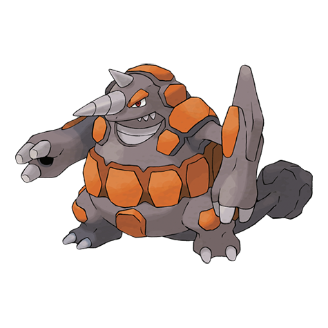

# Rhyperior (#0464)

*Drill Pokemon*

**Type:** Terra / Roccia
**Abilities:** [[Lightning Rod]], [[Solid Rock]], [[Reckless]] *(Hidden)*
**Base HP:** 6

> They have rarely been seen in the wild and only in the tallest mountains. It has holes on its hands which are used like canons to shoot boulders. Be careful, they are very aggressive but not very smart.

---

## Statistiche (Attributes & Limits)

| Attribute | Base / Limit |
|---|---|
| **Strength** | 3/7 |
| **Dexterity** | 1/3 |
| **Vitality** | 3/7 |
| **Special** | 2/4 |
| **Insight** | 2/4 |

---

## Mosse (Learnset)

- **Starter:** [[Tail_Whip|Tail Whip]], [[Horn_Attack|Horn Attack]]
- **Beginner:** [[Stomp|Stomp]]
- **Amateur:** [[Poison_Jab|Poison Jab]], [[Fury_Attack|Fury Attack]], [[Scary_Face|Scary Face]], [[Rock_Blast|Rock Blast]], [[Chip_Away|Chip Away]], [[Take_Down|Take Down]], [[Hammer_Arm|Hammer Arm]], [[Drill_Run|Drill Run]]
- **Ace:** [[Stone_Edge|Stone Edge]], [[Earthquake|Earthquake]], [[Horn_Drill|Horn Drill]], [[Megahorn|Megahorn]], [[Rock_Wrecker|Rock Wrecker]]
- **Pro:** [[Guard_Split|Guard Split]], [[Smart_Strike|Smart Strike]], [[Dragon_Rush|Dragon Rush]]

---

