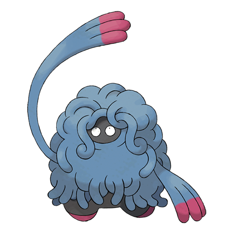

# Tangrowth (#0465)

*Vine Pokemon*

**Type:** Erba
**Abilities:** [[Chlorophyll]], [[Leaf Guard]], [[Regenerator]] *(Hidden)*
**Base HP:** 5

> While it remains still, it appears to be a large shrub. Unsuspecting prey that wander near get ensnared by its vines. In the summer months, its vines grow so large that you can’t even see its eyes.

---

## Statistiche (Attributes & Limits)

| Attribute | Base / Limit |
|---|---|
| **Strength** | 3/6 |
| **Dexterity** | 2/4 |
| **Vitality** | 3/7 |
| **Special** | 3/6 |
| **Insight** | 2/4 |

---

## Mosse (Learnset)

- **Starter:** [[Block|Block]], [[Ingrain|Ingrain]], [[Constrict|Constrict]]
- **Beginner:** [[Sleep_Powder|Sleep Powder]], [[Vine_Whip|Vine Whip]], [[Absorb|Absorb]]
- **Amateur:** [[Poison_Powder|Poison Powder]], [[Bind|Bind]], [[Growth|Growth]], [[Mega_Drain|Mega Drain]], [[Knock_Off|Knock Off]], [[Stun_Spore|Stun Spore]], [[Natural_Gift|Natural Gift]], [[Slam|Slam]], [[Ancient_Power|Ancient Power]]
- **Ace:** [[Giga_Drain|Giga Drain]], [[Tickle|Tickle]], [[Wring_Out|Wring Out]], [[Grassy_Terrain|Grassy Terrain]], [[Power_Whip|Power Whip]]
- **Pro:** [[Nature_Power|Nature Power]], [[Confusion|Confusion]], [[Amnesia|Amnesia]]

---

