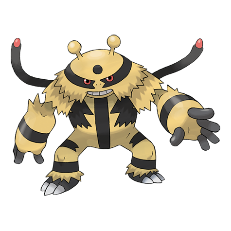

# Electivire (#0466)

*Thunderbolt Pokemon*

**Type:** Elettro
**Abilities:** [[Motor Drive]], [[Vital Spirit]] *(Hidden)*
**Base HP:** 5

> This Pokemon is reckless and has a short temper. As its electric charge amplifies, blue sparks begin to crackle between its horns. It has registered charge levels of over 20,000 Volts.

---

## Statistiche (Attributes & Limits)

| Attribute | Base / Limit |
|---|---|
| **Strength** | 3/7 |
| **Dexterity** | 3/6 |
| **Vitality** | 2/4 |
| **Special** | 3/6 |
| **Insight** | 2/5 |

---

## Mosse (Learnset)

- **Starter:** [[Quick_Attack|Quick Attack]], [[Ion_Deluge|Ion Deluge]], [[Leer|Leer]]
- **Beginner:** [[Electric_Terrain|Electric Terrain]], [[Low_Kick|Low Kick]], [[Thunder_Shock|Thunder Shock]]
- **Amateur:** [[Fire_Punch|Fire Punch]], [[Thunderbolt|Thunderbolt]], [[Shock_Wave|Shock Wave]], [[Thunder_Wave|Thunder Wave]], [[Electro_Ball|Electro Ball]], [[Light_Screen|Light Screen]], [[Thunder_Punch|Thunder Punch]], [[Swift|Swift]]
- **Ace:** [[Screech|Screech]], [[Discharge|Discharge]], [[Thunder|Thunder]], [[Giga_Impact|Giga Impact]]
- **Pro:** [[Hammer_Arm|Hammer Arm]], [[Ice_Punch|Ice Punch]], [[Dual_Chop|Dual Chop]]

---

