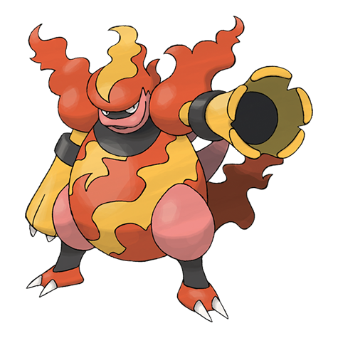

# Magmortar (#0467)

*Blast Pokemon*

**Type:** Fuoco
**Abilities:** [[Flame Body]], [[Vital Spirit]] *(Hidden)*
**Base HP:** 5

> Magmortar is extremely rare, if you’re lucky you can find one living directly on volcanic craters. It rises the temperature of its body at will to the point of bursting into flames. The fire it produces is almost white.

---

## Statistiche (Attributes & Limits)

| Attribute | Base / Limit |
|---|---|
| **Strength** | 3/6 |
| **Dexterity** | 2/5 |
| **Vitality** | 2/4 |
| **Special** | 3/7 |
| **Insight** | 3/6 |

---

## Mosse (Learnset)

- **Starter:** [[Leer|Leer]], [[Smog|Smog]]
- **Beginner:** [[Smokescreen|Smokescreen]], [[Ember|Ember]]
- **Amateur:** [[Thunder_Punch|Thunder Punch]], [[Feint_Attack|Feint Attack]], [[Fire_Spin|Fire Spin]], [[Clear_Smog|Clear Smog]], [[Flame_Burst|Flame Burst]], [[Confuse_Ray|Confuse Ray]], [[Fire_Punch|Fire Punch]], [[Flamethrower|Flamethrower]]
- **Ace:** [[Sunny_Day|Sunny Day]], [[Lava_Plume|Lava Plume]], [[Fire_Blast|Fire Blast]], [[Hyper_Beam|Hyper Beam]]
- **Pro:** [[Dual_Chop|Dual Chop]], [[Belly_Drum|Belly Drum]], [[Heat_Wave|Heat Wave]]

---

