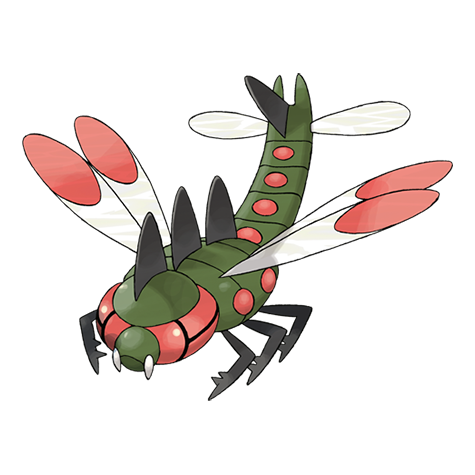

# Yanmega (#0469)

*Ogre Darner Pokemon*

**Type:** Insetto / Volante
**Abilities:** [[Speed Boost]], [[Compound Eyes]], [[Frisk]] *(Hidden)*
**Base HP:** 4

> It goes back to its prehistoric roots. It is a lot more violent than its pre-evolved form. Its jaw power is incredible and it is adept at biting apart foes while flying by at high speed. This Pokemon can be brutal

---

## Statistiche (Attributes & Limits)

| Attribute | Base / Limit |
|---|---|
| **Strength** | 2/5 |
| **Dexterity** | 3/6 |
| **Vitality** | 2/5 |
| **Special** | 3/6 |
| **Insight** | 2/4 |

---

## Mosse (Learnset)

- **Starter:** [[Tackle|Tackle]], [[Foresight|Foresight]]
- **Beginner:** [[Bug_Bite|Bug Bite]], [[Double_Team|Double Team]], [[Quick_Attack|Quick Attack]]
- **Amateur:** [[Slash|Slash]], [[Sonic_Boom|Sonic Boom]], [[Detect|Detect]], [[Supersonic|Supersonic]], [[Uproar|Uproar]], [[Pursuit|Pursuit]], [[Ancient_Power|Ancient Power]], [[Feint|Feint]]
- **Ace:** [[Night_Slash|Night Slash]], [[Screech|Screech]], [[U_Turn|U-Turn]], [[Air_Slash|Air Slash]], [[Bug_Buzz|Bug Buzz]]
- **Pro:** [[Giga_Drain|Giga Drain]], [[Reversal|Reversal]], [[Tailwind|Tailwind]]

---

