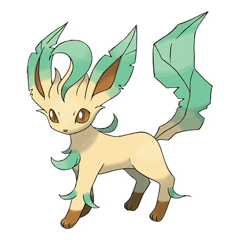

# Leafeon (#0470)

*Verdant Pokemon*

**Type:** Erba
**Abilities:** [[Leaf Guard]], [[Chlorophyll]] *(Hidden)*
**Base HP:** 4

> Eevee evolves to Leafeon when it’s living near a special kind of moss. Its cells are capable of performing photosynthesis. It is a calm Pokemon and does not usually fight but its leaves are sharp and strong.

---

## Statistiche (Attributes & Limits)

| Attribute | Base / Limit |
|---|---|
| **Strength** | 3/6 |
| **Dexterity** | 3/6 |
| **Vitality** | 3/7 |
| **Special** | 2/4 |
| **Insight** | 2/4 |

---

## Mosse (Learnset)

- **Starter:** [[Tackle|Tackle]], [[Tail_Whip|Tail Whip]], [[Helping_Hand|Helping Hand]]
- **Beginner:** [[Sand_Attack|Sand Attack]], [[Razor_Leaf|Razor Leaf]]
- **Amateur:** [[Quick_Attack|Quick Attack]], [[Grass_Whistle|Grass Whistle]], [[Magical_Leaf|Magical Leaf]], [[Giga_Drain|Giga Drain]], [[Swords_Dance|Swords Dance]], [[Synthesis|Synthesis]]
- **Ace:** [[Sunny_Day|Sunny Day]], [[Last_Resort|Last Resort]], [[Leaf_Blade|Leaf Blade]]
- **Pro:** [[Wish|Wish]], [[Seed_Bomb|Seed Bomb]], [[Flail|Flail]]

---

