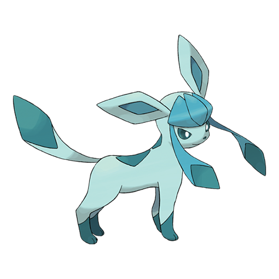

# Glaceon (#0471)

*Fresh Snow Pokemon*

**Type:** Ghiaccio
**Abilities:** [[Snow Cloak]], [[Ice Body]] *(Hidden)*
**Base HP:** 4

> Eevees that are forced to live in freezing temperatures evolve into this Pokemon. It can control its body temperature to below zero, freezing its fur and making it extremely tough.

---

## Statistiche (Attributes & Limits)

| Attribute | Base / Limit |
|---|---|
| **Strength** | 2/4 |
| **Dexterity** | 2/4 |
| **Vitality** | 3/6 |
| **Special** | 3/7 |
| **Insight** | 3/6 |

---

## Mosse (Learnset)

- **Starter:** [[Tackle|Tackle]], [[Tail_Whip|Tail Whip]], [[Helping_Hand|Helping Hand]]
- **Beginner:** [[Sand_Attack|Sand Attack]], [[Icy_Wind|Icy Wind]]
- **Amateur:** [[Quick_Attack|Quick Attack]], [[Bite|Bite]], [[Ice_Fang|Ice Fang]], [[Ice_Shard|Ice Shard]], [[Barrier|Barrier]], [[Mirror_Coat|Mirror Coat]]
- **Ace:** [[Hail|Hail]], [[Last_Resort|Last Resort]], [[Blizzard|Blizzard]]
- **Pro:** [[Wish|Wish]], [[Captivate|Captivate]], [[Fake_Tears|Fake Tears]]

---

