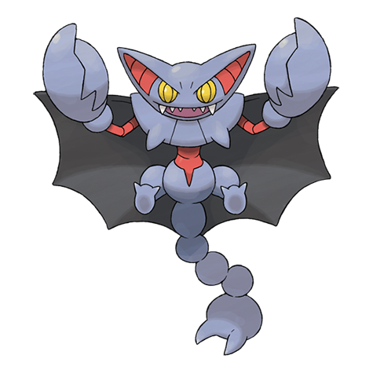

# Gliscor (#0472)

*Fang Scorp Pokemon*

**Type:** Terra / Volante
**Abilities:** [[Hyper Cutter]], [[Sand Veil]], [[Poison Heal]] *(Hidden)*
**Base HP:** 5

> Its flight is soundless. It uses its lengthy tail to carry off its prey, then uses its long fangs to do the rest. It is more playful than aggressive but it is dangerous if you get close to the enormous claws.

---

## Statistiche (Attributes & Limits)

| Attribute | Base / Limit |
|---|---|
| **Strength** | 3/6 |
| **Dexterity** | 3/6 |
| **Vitality** | 3/7 |
| **Special** | 2/4 |
| **Insight** | 2/5 |

---

## Mosse (Learnset)

- **Starter:** [[Sand_Attack|Sand Attack]], [[Harden|Harden]]
- **Beginner:** [[Knock_Off|Knock Off]], [[Quick_Attack|Quick Attack]]
- **Amateur:** [[Thunder_Fang|Thunder Fang]], [[Fire_Fang|Fire Fang]], [[Ice_Fang|Ice Fang]], [[Poison_Jab|Poison Jab]], [[Fury_Cutter|Fury Cutter]], [[Feint_Attack|Feint Attack]], [[Acrobatics|Acrobatics]], [[Night_Slash|Night Slash]], [[U_Turn|U-Turn]]
- **Ace:** [[Screech|Screech]], [[X_Scissor|X-Scissor]], [[Sky_Uppercut|Sky Uppercut]], [[Swords_Dance|Swords Dance]], [[Guillotine|Guillotine]]
- **Pro:** [[Agility|Agility]], [[Metal_Claw|Metal Claw]], [[Cross_Poison|Cross Poison]]

---

