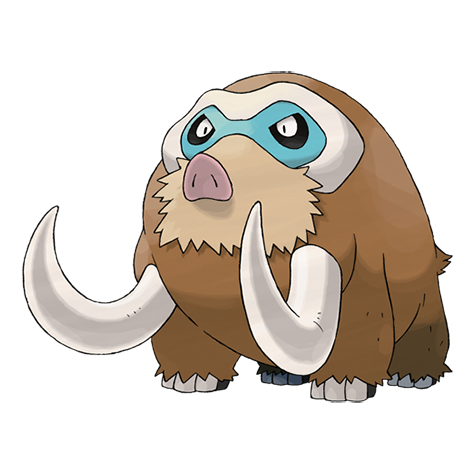

# Mamoswine (#0473)

*Twin Tusk Pokemon*

**Type:** Ghiaccio / Terra
**Abilities:** [[Oblivious]], [[Snow Cloak]], [[Thick Fat]] *(Hidden)*
**Base HP:** 6

> It was everywhere during the ice age but its population declined afterwards. This Pokemon uses strong tusks to remove the soil and snow and dig up roots and plants to eat. It has a bad temper.

---

## Statistiche (Attributes & Limits)

| Attribute | Base / Limit |
|---|---|
| **Strength** | 3/7 |
| **Dexterity** | 2/5 |
| **Vitality** | 2/5 |
| **Special** | 2/5 |
| **Insight** | 2/4 |

---

## Mosse (Learnset)

- **Starter:** [[Peck|Peck]], [[Odor_Sleuth|Odor Sleuth]], [[Mud_Sport|Mud Sport]]
- **Beginner:** [[Powder_Snow|Powder Snow]], [[Mud_Slap|Mud Slap]], [[Scary_Face|Scary Face]]
- **Amateur:** [[Ancient_Power|Ancient Power]], [[Endure|Endure]], [[Mud_Bomb|Mud Bomb]], [[Hail|Hail]], [[Ice_Fang|Ice Fang]], [[Take_Down|Take Down]], [[Double_Hit|Double Hit]]
- **Ace:** [[Mist|Mist]], [[Thrash|Thrash]], [[Earthquake|Earthquake]], [[Blizzard|Blizzard]]
- **Pro:** [[Fissure|Fissure]], [[Icicle_Crash|Icicle Crash]], [[Avalanche|Avalanche]]

---

