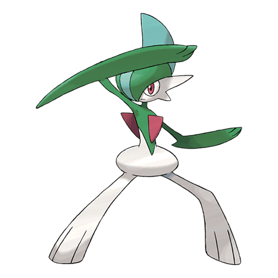

# Gallade (#0475)

*Blade Pokemon*

**Type:** Psico / Lotta
**Abilities:** [[Steadfast]], [[Justified]] *(Hidden)*
**Base HP:** 5

> This Pokemon is male only. He has an extreme sense of courtesy. In a battle, it uses the blades on his arms as if they were swords. It is a loyal Pokemon and won’t doubt to fiercely protect its trainer.

---

## Statistiche (Attributes & Limits)

| Attribute | Base / Limit |
|---|---|
| **Strength** | 3/7 |
| **Dexterity** | 2/5 |
| **Vitality** | 2/4 |
| **Special** | 2/4 |
| **Insight** | 3/6 |

---

## Mosse (Learnset)

- **Starter:** [[Leer|Leer]], [[Confusion|Confusion]]
- **Beginner:** [[Double_Team|Double Team]], [[Teleport|Teleport]], [[Quick_Guard|Quick Guard]]
- **Amateur:** [[False_Swipe|False Swipe]], [[Feint|Feint]], [[Fury_Cutter|Fury Cutter]], [[Wide_Guard|Wide Guard]], [[Slash|Slash]], [[Heal_Pulse|Heal Pulse]], [[Swords_Dance|Swords Dance]], [[Psycho_Cut|Psycho Cut]], [[Helping_Hand|Helping Hand]]
- **Ace:** [[Leaf_Blade|Leaf Blade]], [[Night_Slash|Night Slash]], [[Protect|Protect]], [[Close_Combat|Close Combat]], [[Stored_Power|Stored Power]]
- **Pro:** [[Shadow_Sneak|Shadow Sneak]], [[Thunder_Punch|Thunder Punch]], [[Drain_Punch|Drain Punch]]

---

## Correlati

### Catena Evolutiva
- [[0475_Gallade|Gallade]]
- Gallade (Mega Form)

---

## Mega Gallade (#0475M1)

**Type:** Psico / Lotta
**Abilities:** [[Inner Focus]]
**Base HP:** 6

| Attribute | Base / Limit |
|---|---|
| **Strength** | 4/8 |
| **Dexterity** | 3/6 |
| **Vitality** | 3/6 |
| **Special** | 2/4 |
| **Insight** | 3/6 |

### Mosse

- **Starter:** [[Leer|Leer]], [[Confusion|Confusion]]
- **Beginner:** [[Double_Team|Double Team]], [[Teleport|Teleport]], [[Quick_Guard|Quick Guard]]
- **Amateur:** [[False_Swipe|False Swipe]], [[Feint|Feint]], [[Fury_Cutter|Fury Cutter]], [[Wide_Guard|Wide Guard]], [[Slash|Slash]], [[Heal_Pulse|Heal Pulse]], [[Swords_Dance|Swords Dance]], [[Psycho_Cut|Psycho Cut]], [[Helping_Hand|Helping Hand]]
- **Ace:** [[Leaf_Blade|Leaf Blade]], [[Night_Slash|Night Slash]], [[Protect|Protect]], [[Close_Combat|Close Combat]], [[Stored_Power|Stored Power]]
- **Pro:** [[Shadow_Sneak|Shadow Sneak]], [[Thunder_Punch|Thunder Punch]], [[Drain_Punch|Drain Punch]]
