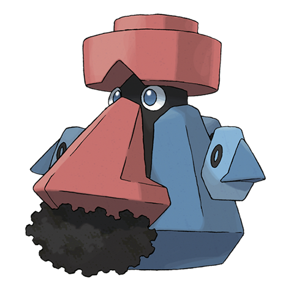

# Probopass (#0476)

*Compass Pokemon*

**Type:** Roccia / Acciaio
**Abilities:** [[Sturdy]], [[Magnet Pull]], [[Sand Force]] *(Hidden)*
**Base HP:** 4

> It exudes strong magnetism from all over. It controls three small units called Mini-Noses that float around and act as arms. It usually stays motionless unless attacked or provoked.

---

## Statistiche (Attributes & Limits)

| Attribute | Base / Limit |
|---|---|
| **Strength** | 2/4 |
| **Dexterity** | 2/5 |
| **Vitality** | 4/8 |
| **Special** | 2/5 |
| **Insight** | 4/8 |

---

## Mosse (Learnset)

- **Starter:** [[Tackle|Tackle]], [[Block|Block]]
- **Beginner:** [[Iron_Defense|Iron Defense]], [[Magnet_Bomb|Magnet Bomb]]
- **Amateur:** [[Tri_Attack|Tri Attack]], [[Magnetic_Flux|Magnetic Flux]], [[Magnet_Rise|Magnet Rise]], [[Gravity|Gravity]], [[Wide_Guard|Wide Guard]], [[Thunder_Wave|Thunder Wave]], [[Rock_Blast|Rock Blast]], [[Rest|Rest]], [[Spark|Spark]], [[Rock_Slide|Rock Slide]], [[Power_Gem|Power Gem]], [[Sandstorm|Sandstorm]]
- **Ace:** [[Discharge|Discharge]], [[Earth_Power|Earth Power]], [[Stone_Edge|Stone Edge]], [[Lock_On|Lock-On]], [[Zap_Cannon|Zap Cannon]]
- **Pro:** [[Endure|Endure]], [[Iron_Head|Iron Head]], [[Ancient_Power|Ancient Power]]

---

