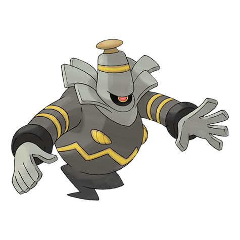

# Dusknoir (#0477)

*Gripper Pokemon*

**Type:** Spettro
**Abilities:** [[Pressure]], [[Frisk]] *(Hidden)*
**Base HP:** 4

> This feared Pokemon is said to travel to the other world. Some even believe that it takes lost spirits along with it. It uses the antenna on it’s head to receive messages from the deceased.

---

## Statistiche (Attributes & Limits)

| Attribute | Base / Limit |
|---|---|
| **Strength** | 3/6 |
| **Dexterity** | 2/4 |
| **Vitality** | 3/7 |
| **Special** | 2/4 |
| **Insight** | 3/7 |

---

## Mosse (Learnset)

- **Starter:** [[Bind|Bind]], [[Leer|Leer]]
- **Beginner:** [[Night_Shade|Night Shade]], [[Disable|Disable]], [[Foresight|Foresight]]
- **Amateur:** [[Shadow_Punch|Shadow Punch]], [[Fire_Punch|Fire Punch]], [[Ice_Punch|Ice Punch]], [[Thunder_Punch|Thunder Punch]], [[Astonish|Astonish]], [[Confuse_Ray|Confuse Ray]], [[Shadow_Sneak|Shadow Sneak]], [[Pursuit|Pursuit]], [[Curse|Curse]], [[Will_O_Wisp|Will-O-Wisp]]
- **Ace:** [[Gravity|Gravity]], [[Hex|Hex]], [[Shadow_Ball|Shadow Ball]], [[Mean_Look|Mean Look]], [[Payback|Payback]], [[Future_Sight|Future Sight]]
- **Pro:** [[Imprison|Imprison]], [[Ominous_Wind|Ominous Wind]], [[Sucker_Punch|Sucker Punch]]

---

