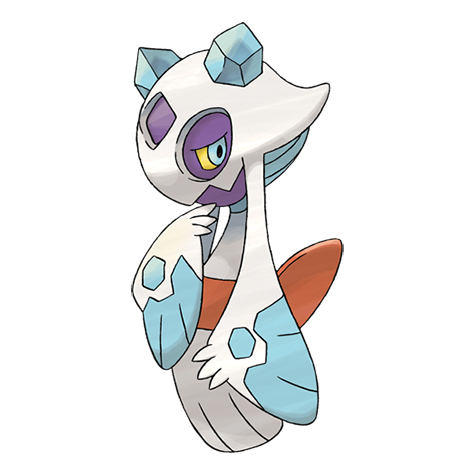

# Froslass (#0478)

*Snow Land Pokemon*

**Type:** Ghiaccio / Spettro
**Abilities:** [[Snow Cloak]], [[Cursed Body]] *(Hidden)*
**Base HP:** 4

> This Pokemon is female only. Legends in snowy regions say that a woman who was lost at an icy mountain was reborn as Froslass. It appears during blizzards to take lost people away.

---

## Statistiche (Attributes & Limits)

| Attribute | Base / Limit |
|---|---|
| **Strength** | 2/5 |
| **Dexterity** | 3/6 |
| **Vitality** | 2/5 |
| **Special** | 2/5 |
| **Insight** | 2/5 |

---

## Mosse (Learnset)

- **Starter:** [[Leer|Leer]], [[Powder_Snow|Powder Snow]]
- **Beginner:** [[Ice_Shard|Ice Shard]], [[Double_Team|Double Team]], [[Astonish|Astonish]]
- **Amateur:** [[Confuse_Ray|Confuse Ray]], [[Icy_Wind|Icy Wind]], [[Draining_Kiss|Draining Kiss]], [[Ominous_Wind|Ominous Wind]], [[Wake_Up_Slap|Wake-Up Slap]], [[Will_O_Wisp|Will-O-Wisp]], [[Destiny_Bond|Destiny Bond]], [[Captivate|Captivate]]
- **Ace:** [[Blizzard|Blizzard]], [[Hail|Hail]]
- **Pro:** [[Spite|Spite]], [[Aurora_Veil|Aurora Veil]], [[Weather_Ball|Weather Ball]]

---

