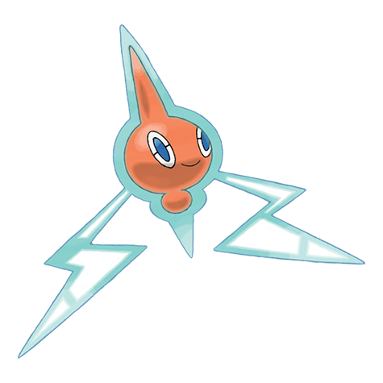

# Rotom (#0479)

*Plasma Pokemon*

**Type:** Elettro / Spettro
**Abilities:** [[Levitate]]
**Base HP:** 4

> Its electric-like body can enter some kinds of machines and take control of them in order to cause mischief. It changes its form to that of the electric appliance, allowing it to become more powerful.

---

## Statistiche (Attributes & Limits)

| Attribute | Base / Limit |
|---|---|
| **Strength** | 2/4 |
| **Dexterity** | 2/5 |
| **Vitality** | 2/5 |
| **Special** | 3/6 |
| **Insight** | 2/5 |

---

## Mosse (Learnset)

- **Starter:** [[Thunder_Wave|Thunder Wave]], [[Astonish|Astonish]]
- **Beginner:** [[Confuse_Ray|Confuse Ray]], [[Thunder_Shock|Thunder Shock]], [[Uproar|Uproar]]
- **Amateur:** [[Trick|Trick]], [[Double_Team|Double Team]], [[Shock_Wave|Shock Wave]], [[Ominous_Wind|Ominous Wind]], [[Substitute|Substitute]], [[Electro_Ball|Electro Ball]]
- **Ace:** [[Hex|Hex]], [[Charge|Charge]], [[Discharge|Discharge]]

---

## Correlati

### Catena Evolutiva
- [[0479_Rotom|Rotom]]
- Rotom (Heat Form)
- Rotom (Fan Form)
- Rotom (Mow Form)
- Rotom (Frost Form)
- Rotom (Wash Form)
- Rotom (Dex Form)
