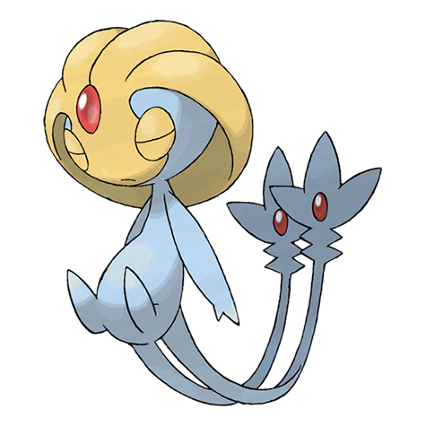

# Uxie (#0480)

*No Data*

**Type:** Psico
**Abilities:** [[Levitate]]
**Base HP:** 4

> In the myths of Sinnoh they talk about three beings that came out from the same egg, the yellow one was the being of knowledge. Together they shaped the human race to be complete.

---

## Statistiche (Attributes & Limits)

| Attribute | Base / Limit |
|---|---|
| **Strength** | 5/5 |
| **Dexterity** | 6/6 |
| **Vitality** | 7/7 |
| **Special** | 5/5 |
| **Insight** | 7/7 |

---

## Mosse (Learnset)

- **Master:** [[Memento|Memento]], [[Natural_Gift|Natural Gift]], [[Flail|Flail]], [[Rest|Rest]], [[Confusion|Confusion]], [[Imprison|Imprison]], [[Endure|Endure]], [[Swift|Swift]], [[Yawn|Yawn]], [[Future_Sight|Future Sight]], [[Amnesia|Amnesia]], [[Extrasensory|Extrasensory]], [[Foul_Play|Foul Play]], [[Hidden_Power|Hidden Power]], [[Psych_Up|Psych Up]], [[Trick_Room|Trick Room]], [[Magic_Room|Magic Room]], [[Wonder_Room|Wonder Room]]

---

