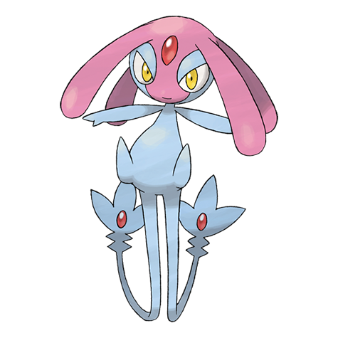

# Mesprit (#0481)

*No Data*

**Type:** Psico
**Abilities:** [[Levitate]]
**Base HP:** 4

> In the myths of Sinnoh they talk about three beings that came out from the same egg, the pink one was the being of emotion. Together they shaped the human race to be complete.

---

## Statistiche (Attributes & Limits)

| Attribute | Base / Limit |
|---|---|
| **Strength** | 6/6 |
| **Dexterity** | 5/5 |
| **Vitality** | 6/6 |
| **Special** | 6/6 |
| **Insight** | 6/6 |

---

## Mosse (Learnset)

- **Master:** [[Healing_Wish|Healing Wish]], [[Natural_Gift|Natural Gift]], [[Copycat|Copycat]], [[Rest|Rest]], [[Confusion|Confusion]], [[Imprison|Imprison]], [[Protect|Protect]], [[Swift|Swift]], [[Lucky_Chant|Lucky Chant]], [[Future_Sight|Future Sight]], [[Charm|Charm]], [[Extrasensory|Extrasensory]], [[Helping_Hand|Helping Hand]], [[Hidden_Power|Hidden Power]], [[Psych_Up|Psych Up]], [[Role_Play|Role Play]], [[Knock_Off|Knock Off]], [[Trick|Trick]]

---

