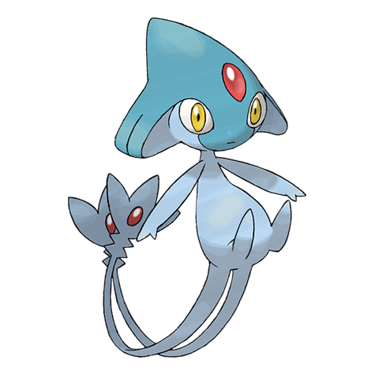

# Azelf (#0482)

*No Data*

**Type:** Psico
**Abilities:** [[Levitate]]
**Base HP:** 4

> In the myths of Sinnoh they talk about three beings that came out from the same egg, the blue one was the being of willpower. Together they shaped the human race to be complete.

---

## Statistiche (Attributes & Limits)

| Attribute | Base / Limit |
|---|---|
| **Strength** | 7/7 |
| **Dexterity** | 7/7 |
| **Vitality** | 5/5 |
| **Special** | 7/7 |
| **Insight** | 5/5 |

---

## Mosse (Learnset)

- **Master:** [[Last_Resort|Last Resort]], [[Natural_Gift|Natural Gift]], [[Flail|Flail]], [[Rest|Rest]], [[Confusion|Confusion]], [[Imprison|Imprison]], [[Detect|Detect]], [[Swift|Swift]], [[Uproar|Uproar]], [[Future_Sight|Future Sight]], [[Nasty_Plot|Nasty Plot]], [[Extrasensory|Extrasensory]], [[Explosion|Explosion]], [[Hidden_Power|Hidden Power]], [[Swords_Dance|Swords Dance]], [[Stealth_Rock|Stealth Rock]], [[Skill_Swap|Skill Swap]], [[Zen_Headbutt|Zen Headbutt]]

---

