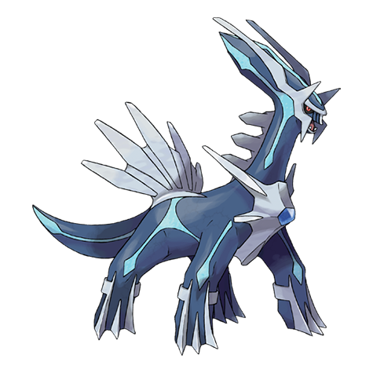

# Dialga (#0483)

*No Data*

**Type:** Acciaio / Drago
**Abilities:** [[Pressure]], [[Telepathy]] *(Hidden)*
**Base HP:** 7

> In some religions there is a being called “The God of Time” whose first roar brought future, present and past.

---

## Statistiche (Attributes & Limits)

| Attribute | Base / Limit |
|---|---|
| **Strength** | 7/7 |
| **Dexterity** | 5/5 |
| **Vitality** | 7/7 |
| **Special** | 8/8 |
| **Insight** | 6/6 |

---

## Mosse (Learnset)

- **Master:** [[Dragon_Breath|Dragon Breath]], [[Scary_Face|Scary Face]], [[Metal_Claw|Metal Claw]], [[Ancient_Power|Ancient Power]], [[Slash|Slash]], [[Power_Gem|Power Gem]], [[Metal_Burst|Metal Burst]], [[Dragon_Claw|Dragon Claw]], [[Earth_Power|Earth Power]], [[Aura_Sphere|Aura Sphere]], [[Iron_Tail|Iron Tail]], [[Roar_Of_Time|Roar Of Time]], [[Flash_Cannon|Flash Cannon]], [[Hidden_Power|Hidden Power]], [[Psych_Up|Psych Up]], [[Trick_Room|Trick Room]], [[Dragon_Pulse|Dragon Pulse]], [[Iron_Defense|Iron Defense]]

---

