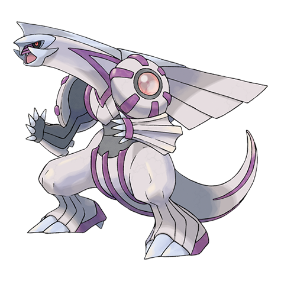

# Palkia (#0484)

*No Data*

**Type:** Acqua / Drago
**Abilities:** [[Pressure]], [[Telepathy]] *(Hidden)*
**Base HP:** 5

> A fantasy book describes a place where space bends in impossible ways and the master of that site was a Pokemon with a similar appearance.

---

## Statistiche (Attributes & Limits)

| Attribute | Base / Limit |
|---|---|
| **Strength** | 7/7 |
| **Dexterity** | 6/6 |
| **Vitality** | 6/6 |
| **Special** | 8/8 |
| **Insight** | 7/7 |

---

## Mosse (Learnset)

- **Master:** [[Dragon_Breath|Dragon Breath]], [[Scary_Face|Scary Face]], [[Water_Pulse|Water Pulse]], [[Ancient_Power|Ancient Power]], [[Slash|Slash]], [[Power_Gem|Power Gem]], [[Aqua_Tail|Aqua Tail]], [[Dragon_Claw|Dragon Claw]], [[Earth_Power|Earth Power]], [[Aura_Sphere|Aura Sphere]], [[Hyper_Voice|Hyper Voice]], [[Spacial_Rend|Spacial Rend]], [[Hydro_Pump|Hydro Pump]], [[Hidden_Power|Hidden Power]], [[Psych_Up|Psych Up]], [[Gravity|Gravity]], [[Dragon_Pulse|Dragon Pulse]], [[Liquidation|Liquidation]]

---

