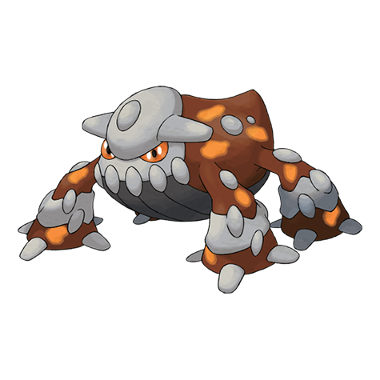

# Heatran (#0485)

*No Data*

**Type:** Fuoco / Acciaio
**Abilities:** [[Flash Fire]], [[Flame Body]] *(Hidden)*
**Base HP:** 4

> An old painting showed a similar Pokemon standing atop of an erupting Volcano.

---

## Statistiche (Attributes & Limits)

| Attribute | Base / Limit |
|---|---|
| **Strength** | 5/5 |
| **Dexterity** | 5/5 |
| **Vitality** | 6/6 |
| **Special** | 7/7 |
| **Insight** | 6/6 |

---

## Mosse (Learnset)

- **Master:** [[Ancient_Power|Ancient Power]], [[Leer|Leer]], [[Fire_Fang|Fire Fang]], [[Metal_Sound|Metal Sound]], [[Crunch|Crunch]], [[Scary_Face|Scary Face]], [[Lava_Plume|Lava Plume]], [[Fire_Spin|Fire Spin]], [[Iron_Head|Iron Head]], [[Earth_Power|Earth Power]], [[Heat_Wave|Heat Wave]], [[Stone_Edge|Stone Edge]], [[Magma_Storm|Magma Storm]], [[Iron_Defense|Iron Defense]], [[Sunny_Day|Sunny Day]], [[Stomping_Tantrum|Stomping Tantrum]], [[Dragon_Pulse|Dragon Pulse]], [[Uproar|Uproar]]

---

