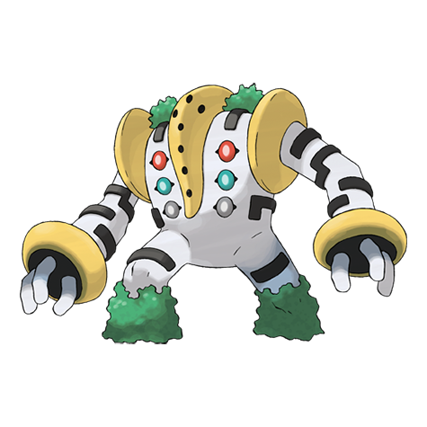

# Regigigas (#0486)

*No Data*

**Type:** Normale
**Abilities:** [[Slow Start]]
**Base HP:** 6

> A very old legend tells about the King of Giants, who could crush a mountain with its grip and mold living titans from the rubble.

---

## Statistiche (Attributes & Limits)

| Attribute | Base / Limit |
|---|---|
| **Strength** | 8/8 |
| **Dexterity** | 6/6 |
| **Vitality** | 6/6 |
| **Special** | 5/5 |
| **Insight** | 6/6 |

---

## Mosse (Learnset)

- **Master:** [[Heavy_Slam|Heavy Slam]], [[Crush_Grip|Crush Grip]], [[Fire_Punch|Fire Punch]], [[Ice_Punch|Ice Punch]], [[Thunder_Punch|Thunder Punch]], [[Dizzy_Punch|Dizzy Punch]], [[Knock_Off|Knock Off]], [[Confuse_Ray|Confuse Ray]], [[Foresight|Foresight]], [[Revenge|Revenge]], [[Wide_Guard|Wide Guard]], [[Zen_Headbutt|Zen Headbutt]], [[Payback|Payback]], [[Hidden_Power|Hidden Power]], [[Psych_Up|Psych Up]], [[Giga_Impact|Giga Impact]], [[Substitute|Substitute]], [[Strength|Strength]], [[Superpower|Superpower]], [[Nature_Power|Nature Power]]

---

