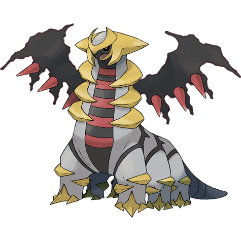

# Giratina (Origin Form) (#0487F1)

*Plot Device*

**Type:** Spettro / Drago
**Abilities:** [[Levitate]]
**Base HP:** 8

> Plot Device

---

## Statistiche (Attributes & Limits)

| Attribute | Base / Limit |
|---|---|
| **Strength** | 7/7 |
| **Dexterity** | 5/5 |
| **Vitality** | 6/6 |
| **Special** | 7/7 |
| **Insight** | 6/6 |

---

## Mosse (Learnset)

- **Master:** [[Dragon_Breath|Dragon Breath]], [[Scary_Face|Scary Face]], [[Ominous_Wind|Ominous Wind]], [[Ancient_Power|Ancient Power]], [[Slash|Slash]], [[Shadow_Sneak|Shadow Sneak]], [[Destiny_Bond|Destiny Bond]], [[Dragon_Claw|Dragon Claw]], [[Earth_Power|Earth Power]], [[Aura_Sphere|Aura Sphere]], [[Shadow_Claw|Shadow Claw]], [[Shadow_Force|Shadow Force]], [[Hex|Hex]], [[Hidden_Power|Hidden Power]], [[Psych_Up|Psych Up]], [[Spite|Spite]], [[Pain_Split|Pain Split]], [[Outrage|Outrage]], [[Draco_Meteor|Draco Meteor]], [[Gravity|Gravity]]

---
