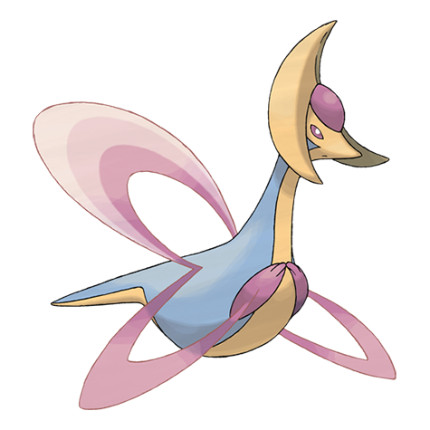

# Cresselia (#0488)

*No Data*

**Type:** Psico
**Abilities:** [[Levitate]]
**Base HP:** 6

> The embodiment of dreams comes to life during the crescent moon nights. You will be blessed with peaceful bedtimes If you keep one of its feathers. Or so they say.

---

## Statistiche (Attributes & Limits)

| Attribute | Base / Limit |
|---|---|
| **Strength** | 5/5 |
| **Dexterity** | 5/5 |
| **Vitality** | 7/7 |
| **Special** | 5/5 |
| **Insight** | 7/7 |

---

## Mosse (Learnset)

- **Master:** [[Lunar_Dance|Lunar Dance]], [[Psycho_Shift|Psycho Shift]], [[Psycho_Cut|Psycho Cut]], [[Moonlight|Moonlight]], [[Confusion|Confusion]], [[Double_Team|Double Team]], [[Safeguard|Safeguard]], [[Mist|Mist]], [[Aurora_Beam|Aurora Beam]], [[Future_Sight|Future Sight]], [[Slash|Slash]], [[Psychic|Psychic]], [[Moonblast|Moonblast]], [[Rest|Rest]], [[Captivate|Captivate]], [[Calm_Mind|Calm Mind]], [[Protect|Protect]], [[Magic_Coat|Magic Coat]], [[Light_Screen|Light Screen]], [[Reflect|Reflect]]

---

