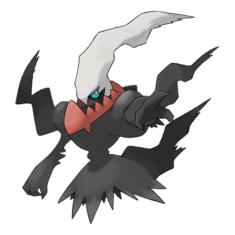

# Darkrai (#0491)

*No Data*

**Type:** Buio
**Abilities:** [[Bad Dreams]]
**Base HP:** 4

> All around the world, young children have depicted a similar figure in their drawings. They call it “The Boogeyman”. People say it will make all your nightmares come true.

---

## Statistiche (Attributes & Limits)

| Attribute | Base / Limit |
|---|---|
| **Strength** | 5/5 |
| **Dexterity** | 7/7 |
| **Vitality** | 5/5 |
| **Special** | 7/7 |
| **Insight** | 5/5 |

---

## Mosse (Learnset)

- **Master:** [[Ominous_Wind|Ominous Wind]], [[Disable|Disable]], [[Quick_Attack|Quick Attack]], [[Hypnosis|Hypnosis]], [[Feint_Attack|Feint Attack]], [[Nightmare|Nightmare]], [[Double_Team|Double Team]], [[Haze|Haze]], [[Dark_Void|Dark Void]], [[Nasty_Plot|Nasty Plot]], [[Dream_Eater|Dream Eater]], [[Dark_Pulse|Dark Pulse]], [[Torment|Torment]], [[Wonder_Room|Wonder Room]], [[Foul_Play|Foul Play]], [[Spite|Spite]]

---

