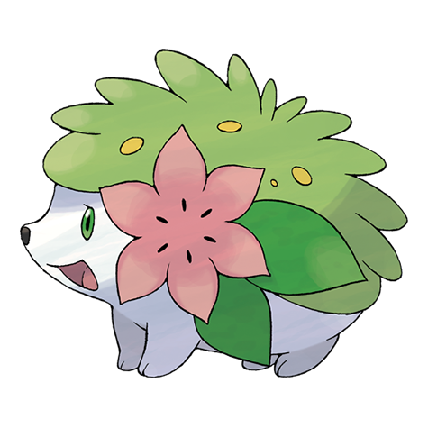

# Shaymin (Sky Form) (#0492F1)

*No Data*

**Type:** Erba / Volante
**Abilities:** [[Serene Grace]]
**Base HP:** 5

> There are old traces of gigantic trees that once grew all over the earth. They were called the “Trees of Life” and their flowers granted the power of flight to the kindhearted, or so the legend says.

---

## Statistiche (Attributes & Limits)

| Attribute | Base / Limit |
|---|---|
| **Strength** | 6/6 |
| **Dexterity** | 7/7 |
| **Vitality** | 5/5 |
| **Special** | 7/7 |
| **Insight** | 5/5 |

---

## Mosse (Learnset)

- **Master:** [[Growth|Growth]], [[Magical_Leaf|Magical Leaf]], [[Leech_Seed|Leech Seed]], [[Synthesis|Synthesis]], [[Sweet_Scent|Sweet Scent]], [[Natural_Gift|Natural Gift]], [[Worry_Seed|Worry Seed]], [[Air_Slash|Air Slash]], [[Energy_Ball|Energy Ball]], [[Sweet_Kiss|Sweet Kiss]], [[Leaf_Storm|Leaf Storm]], [[Seed_Flare|Seed Flare]], [[Endeavor|Endeavor]], [[Zen_Headbutt|Zen Headbutt]], [[Giga_Drain|Giga Drain]], [[Tailwind|Tailwind]]

---
