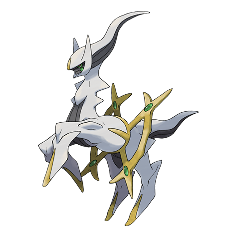

# Arceus (#0493)

*Plot Device*

**Type:** Normale
**Abilities:** [[Multitype]]
**Base HP:** 6

> Plot Device

---

## Statistiche (Attributes & Limits)

| Attribute | Base / Limit |
|---|---|
| **Strength** | 12/12 |
| **Dexterity** | 12/12 |
| **Vitality** | 12/12 |
| **Special** | 12/12 |
| **Insight** | 12/12 |

---

## Mosse (Learnset)

- **Master:** [[Seismic_Toss|Seismic Toss]], [[Cosmic_Power|Cosmic Power]], [[Natural_Gift|Natural Gift]], [[Punishment|Punishment]], [[Gravity|Gravity]], [[Earth_Power|Earth Power]], [[Hyper_Voice|Hyper Voice]], [[Extreme_Speed|Extreme Speed]], [[Refresh|Refresh]], [[Future_Sight|Future Sight]], [[Recover|Recover]], [[Hyper_Beam|Hyper Beam]], [[Perish_Song|Perish Song]], [[Judgment|Judgment]], [[Sunsteel_Strike|Sunsteel Strike]], [[Infestation|Infestation]], [[Zap_Cannon|Zap Cannon]], [[Draco_Meteor|Draco Meteor]], [[Light_Of_Ruin|Light Of Ruin]], [[Inferno|Inferno]], [[Hurricane|Hurricane]], [[Phantom_Force|Phantom Force]], [[Frenzy_Plant|Frenzy Plant]], [[Detect|Detect]], [[Sheer_Cold|Sheer Cold]], [[Sludge_Wave|Sludge Wave]], [[Ancient_Power|Ancient Power]], [[Origin_Pulse|Origin Pulse]]

---

