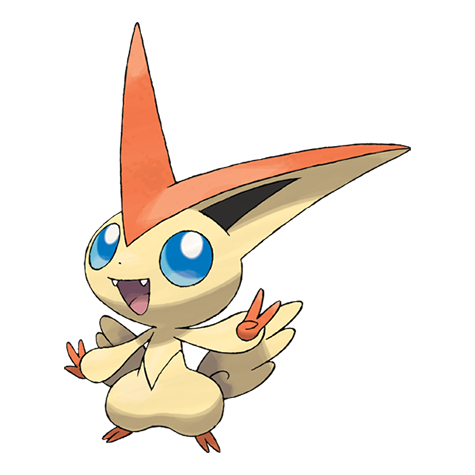

# Victini (#0494)

*No Data*

**Type:** Psico / Fuoco
**Abilities:** [[Victory Star]]
**Base HP:** 5

> On tournament days, Trainers eat a “V” shaped apple as a sign of good luck. It is unknown if it has anything to do with this Pokemon.

---

## Statistiche (Attributes & Limits)

| Attribute | Base / Limit |
|---|---|
| **Strength** | 6/6 |
| **Dexterity** | 6/6 |
| **Vitality** | 6/6 |
| **Special** | 6/6 |
| **Insight** | 6/6 |

---

## Mosse (Learnset)

- **Master:** [[Searing_Shot|Searing Shot]], [[Focus_Energy|Focus Energy]], [[Confusion|Confusion]], [[Incinerate|Incinerate]], [[Quick_Attack|Quick Attack]], [[Endure|Endure]], [[Headbutt|Headbutt]], [[Flame_Charge|Flame Charge]], [[Reversal|Reversal]], [[Flame_Burst|Flame Burst]], [[Zen_Headbutt|Zen Headbutt]], [[Inferno|Inferno]], [[Double_Edge|Double-Edge]], [[Flare_Blitz|Flare Blitz]], [[Final_Gambit|Final Gambit]], [[Stored_Power|Stored Power]], [[Overheat|Overheat]], [[Trick|Trick]], [[Shock_Wave|Shock Wave]], [[V_Create|V-Create]]

---

