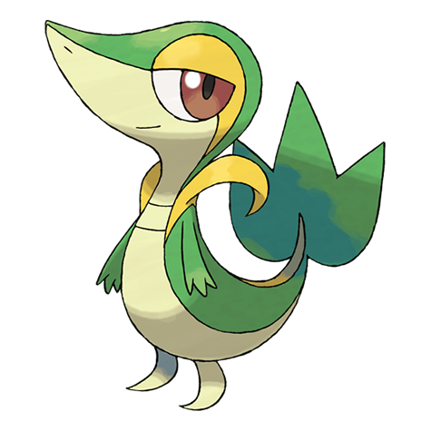

# Snivy (#0495)

*Grass Snake Pokemon*

**Type:** Erba
**Abilities:** [[Overgrow]], [[Contrary]] *(Hidden)*
**Base HP:** 3

> It is very intelligent and independent, although it seems calm it doesn’t like being bossed around. Being exposed to lots of sunlight makes its movements swifter. The tail drops if it is not feeling well.

---

## Statistiche (Attributes & Limits)

| Attribute | Base / Limit |
|---|---|
| **Strength** | 2/4 |
| **Dexterity** | 2/4 |
| **Vitality** | 2/4 |
| **Special** | 2/4 |
| **Insight** | 2/4 |

---

## Mosse (Learnset)

- **Starter:** [[Tackle|Tackle]], [[Leer|Leer]]
- **Beginner:** [[Vine_Whip|Vine Whip]], [[Wrap|Wrap]]
- **Amateur:** [[Growth|Growth]], [[Leaf_Tornado|Leaf Tornado]], [[Leech_Seed|Leech Seed]], [[Mega_Drain|Mega Drain]], [[Slam|Slam]], [[Leaf_Blade|Leaf Blade]], [[Coil|Coil]]
- **Ace:** [[Giga_Drain|Giga Drain]], [[Wring_Out|Wring Out]], [[Gastro_Acid|Gastro Acid]], [[Leaf_Storm|Leaf Storm]]
- **Pro:** [[Grass_Pledge|Grass Pledge]], [[Synthesis|Synthesis]], [[Twister|Twister]]

---

## Correlati

### Catena Evolutiva
- [[0495_Snivy|Snivy]]
- [[0496_Servine|Servine]]
- [[0497_Serperior|Serperior]]

