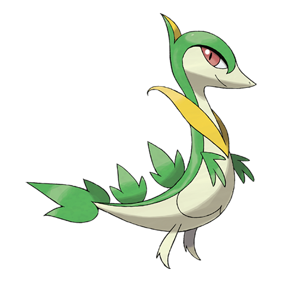

# Servine (#0496)

*Grass Snake Pokemon*

**Type:** Erba
**Abilities:** [[Overgrow]], [[Contrary]] *(Hidden)*
**Base HP:** 4

> It moves along the ground by sliding. Its swift movements befuddle its foes, then attacks with a vine whip. It always keeps itself clean and it demands care from its trainer, otherwise it will misbehave.

---

## Statistiche (Attributes & Limits)

| Attribute | Base / Limit |
|---|---|
| **Strength** | 2/4 |
| **Dexterity** | 2/5 |
| **Vitality** | 2/5 |
| **Special** | 2/4 |
| **Insight** | 2/5 |

---

## Mosse (Learnset)

- **Starter:** [[Tackle|Tackle]], [[Leer|Leer]]
- **Beginner:** [[Vine_Whip|Vine Whip]], [[Wrap|Wrap]]
- **Amateur:** [[Growth|Growth]], [[Leaf_Tornado|Leaf Tornado]], [[Leech_Seed|Leech Seed]], [[Mega_Drain|Mega Drain]], [[Slam|Slam]], [[Leaf_Blade|Leaf Blade]], [[Coil|Coil]]
- **Ace:** [[Giga_Drain|Giga Drain]], [[Wring_Out|Wring Out]], [[Gastro_Acid|Gastro Acid]], [[Leaf_Storm|Leaf Storm]]
- **Pro:** [[Grass_Pledge|Grass Pledge]], [[Synthesis|Synthesis]], [[Twister|Twister]]

---

## Correlati

### Catena Evolutiva
- [[0495_Snivy|Snivy]]
- [[0496_Servine|Servine]]
- [[0497_Serperior|Serperior]]

