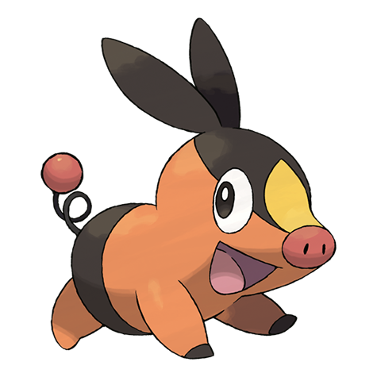

# Tepig (#0498)

*Fire Pig Pokemon*

**Type:** Fuoco
**Abilities:** [[Blaze]], [[Thick Fat]] *(Hidden)*
**Base HP:** 3

> It blows fire through its nose. When it catches a cold, the fire becomes pitch-black smoke instead. Tepig loves to eat roasted berries and its keen sense of smell allows it to find them easily.

---

## Statistiche (Attributes & Limits)

| Attribute | Base / Limit |
|---|---|
| **Strength** | 2/4 |
| **Dexterity** | 2/4 |
| **Vitality** | 2/4 |
| **Special** | 2/4 |
| **Insight** | 2/4 |

---

## Mosse (Learnset)

- **Starter:** [[Tail_Whip|Tail Whip]], [[Tackle|Tackle]]
- **Beginner:** [[Odor_Sleuth|Odor Sleuth]], [[Ember|Ember]]
- **Amateur:** [[Defense_Curl|Defense Curl]], [[Flame_Charge|Flame Charge]], [[Smog|Smog]], [[Rollout|Rollout]], [[Take_Down|Take Down]], [[Heat_Crash|Heat Crash]], [[Assurance|Assurance]]
- **Ace:** [[Flamethrower|Flamethrower]], [[Head_Smash|Head Smash]], [[Roar|Roar]], [[Flare_Blitz|Flare Blitz]]
- **Pro:** [[Fire_Pledge|Fire Pledge]], [[Body_Slam|Body Slam]], [[Sucker_Punch|Sucker Punch]]

---

## Correlati

### Catena Evolutiva
- [[0498_Tepig|Tepig]]
- [[0499_Pignite|Pignite]]
- [[0500_Emboar|Emboar]]

