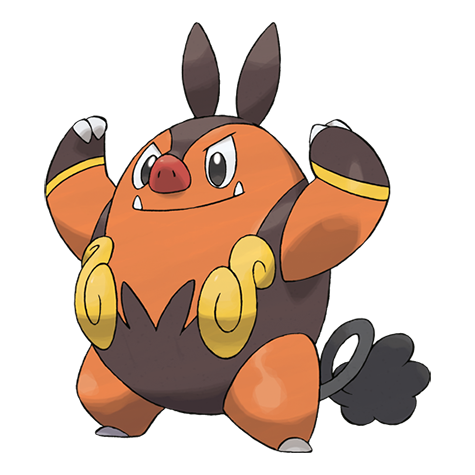

# Pignite (#0499)

*Fire Pig Pokemon*

**Type:** Fuoco / Lotta
**Abilities:** [[Blaze]], [[Thick Fat]] *(Hidden)*
**Base HP:** 4

> Whatever it eats becomes fuel for the flame on its stomach. When it is angered, the intensity of the flame increases. It is not common to see them the wild. They are mostly found living in warm places.

---

## Statistiche (Attributes & Limits)

| Attribute | Base / Limit |
|---|---|
| **Strength** | 2/5 |
| **Dexterity** | 2/4 |
| **Vitality** | 2/4 |
| **Special** | 2/5 |
| **Insight** | 2/4 |

---

## Mosse (Learnset)

- **Starter:** [[Tail_Whip|Tail Whip]], [[Tackle|Tackle]]
- **Beginner:** [[Odor_Sleuth|Odor Sleuth]], [[Ember|Ember]], [[Defense_Curl|Defense Curl]]
- **Amateur:** [[Flame_Charge|Flame Charge]], [[Arm_Thrust|Arm Thrust]], [[Smog|Smog]], [[Rollout|Rollout]], [[Take_Down|Take Down]], [[Heat_Crash|Heat Crash]], [[Assurance|Assurance]]
- **Ace:** [[Flamethrower|Flamethrower]], [[Head_Smash|Head Smash]], [[Roar|Roar]], [[Flare_Blitz|Flare Blitz]]
- **Pro:** [[Fire_Pledge|Fire Pledge]], [[Body_Slam|Body Slam]], [[Sucker_Punch|Sucker Punch]]

---

## Correlati

### Catena Evolutiva
- [[0498_Tepig|Tepig]]
- [[0499_Pignite|Pignite]]
- [[0500_Emboar|Emboar]]

