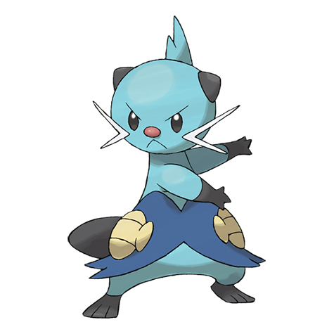

# Dewott (#0502)

*Discipline Pokemon*

**Type:** Acqua
**Abilities:** [[Torrent]], [[Shell Armor]] *(Hidden)*
**Base HP:** 4

> It isolates itself from others and trains every day to perform a double scalchop slash technique. This Pokemon takes itself very seriously and won’t back down from any challenge.

---

## Statistiche (Attributes & Limits)

| Attribute | Base / Limit |
|---|---|
| **Strength** | 2/5 |
| **Dexterity** | 2/4 |
| **Vitality** | 2/4 |
| **Special** | 2/5 |
| **Insight** | 2/4 |

---

## Mosse (Learnset)

- **Starter:** [[Tackle|Tackle]], [[Tail_Whip|Tail Whip]]
- **Beginner:** [[Water_Gun|Water Gun]], [[Water_Sport|Water Sport]]
- **Amateur:** [[Focus_Energy|Focus Energy]], [[Razor_Shell|Razor Shell]], [[Fury_Cutter|Fury Cutter]], [[Water_Pulse|Water Pulse]], [[Revenge|Revenge]], [[Aqua_Jet|Aqua Jet]], [[Encore|Encore]]
- **Ace:** [[Aqua_Tail|Aqua Tail]], [[Retaliate|Retaliate]], [[Swords_Dance|Swords Dance]], [[Hydro_Pump|Hydro Pump]]
- **Pro:** [[Water_Pledge|Water Pledge]], [[Air_Slash|Air Slash]], [[Detect|Detect]]

---

## Correlati

### Catena Evolutiva
- [[0501_Oshawott|Oshawott]]
- [[0502_Dewott|Dewott]]
- [[0503_Samurott|Samurott]]

