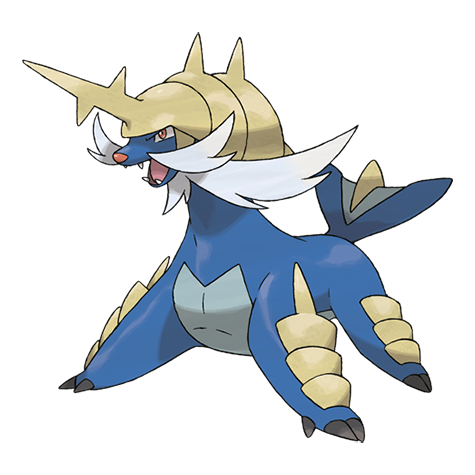

# Samurott (#0503)

*Formidable Pokemon*

**Type:** Acqua
**Abilities:** [[Torrent]], [[Shell Armor]] *(Hidden)*
**Base HP:** 5

> It uses the horn on it’s head and both scimitars attached to it’s front legs as weapons. In the late spring and fall, they gather on cold beaches and fight each other. The winner lets out an intimidating roar.

---

## Statistiche (Attributes & Limits)

| Attribute | Base / Limit |
|---|---|
| **Strength** | 3/6 |
| **Dexterity** | 2/5 |
| **Vitality** | 2/5 |
| **Special** | 3/6 |
| **Insight** | 2/5 |

---

## Mosse (Learnset)

- **Starter:** [[Tail_Whip|Tail Whip]], [[Tackle|Tackle]]
- **Beginner:** [[Water_Sport|Water Sport]], [[Water_Gun|Water Gun]]
- **Amateur:** [[Encore|Encore]], [[Focus_Energy|Focus Energy]], [[Razor_Shell|Razor Shell]], [[Fury_Cutter|Fury Cutter]], [[Water_Pulse|Water Pulse]], [[Revenge|Revenge]], [[Aqua_Jet|Aqua Jet]], [[Slash|Slash]]
- **Ace:** [[Megahorn|Megahorn]], [[Aqua_Tail|Aqua Tail]], [[Retaliate|Retaliate]], [[Swords_Dance|Swords Dance]], [[Hydro_Pump|Hydro Pump]]
- **Pro:** [[Hydro_Cannon|Hydro Cannon]], [[Night_Slash|Night Slash]], [[Smart_Strike|Smart Strike]]

---

## Correlati

### Catena Evolutiva
- [[0501_Oshawott|Oshawott]]
- [[0502_Dewott|Dewott]]
- [[0503_Samurott|Samurott]]

