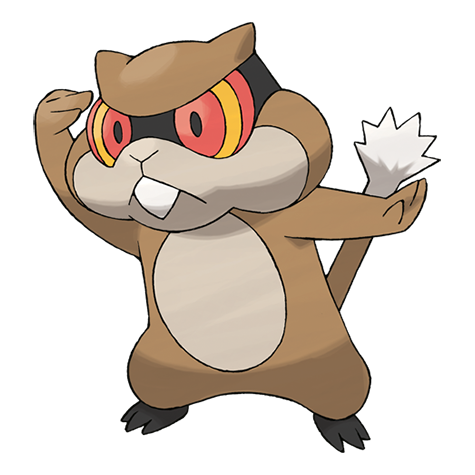

# Patrat (#0504)

*Scout Pokemon*

**Type:** Normale
**Abilities:** [[Run Away]], [[Keen Eye]], [[Analytic]] *(Hidden)*
**Base HP:** 3

> They live in grass fields in big groups. One of them is always looking out for predators. The group gathers food they store on their cheeks to bring it back home. They are wary and alert all the time.

---

## Statistiche (Attributes & Limits)

| Attribute | Base / Limit |
|---|---|
| **Strength** | 2/4 |
| **Dexterity** | 1/3 |
| **Vitality** | 1/3 |
| **Special** | 1/3 |
| **Insight** | 1/3 |

---

## Mosse (Learnset)

- **Starter:** [[Tackle|Tackle]], [[Leer|Leer]]
- **Beginner:** [[Bite|Bite]], [[Bide|Bide]], [[Detect|Detect]]
- **Amateur:** [[Sand_Attack|Sand Attack]], [[Crunch|Crunch]], [[Hypnosis|Hypnosis]], [[Super_Fang|Super Fang]], [[After_You|After You]], [[Work_Up|Work Up]], [[Focus_Energy|Focus Energy]], [[Mean_Look|Mean Look]]
- **Ace:** [[Hyper_Fang|Hyper Fang]], [[Nasty_Plot|Nasty Plot]], [[Baton_Pass|Baton Pass]], [[Slam|Slam]]
- **Pro:** [[Screech|Screech]], [[Seed_Bomb|Seed Bomb]], [[Aqua_Tail|Aqua Tail]]

---

## Correlati

### Catena Evolutiva
- [[0504_Patrat|Patrat]]
- [[0505_Watchog|Watchog]]

