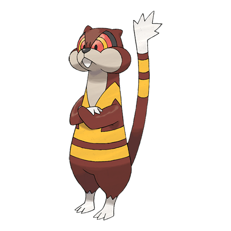

# Watchog (#0505)

*Lookout Pokemon*

**Type:** Normale
**Abilities:** [[Run Away]], [[Keen Eye]], [[Analytic]] *(Hidden)*
**Base HP:** 4

> Their fur has a luminescent property. They make the patterns on their bodies glow in order to threaten predators. Their keen eyesight allows them to see in the dark. They are also good diggers.

---

## Statistiche (Attributes & Limits)

| Attribute | Base / Limit |
|---|---|
| **Strength** | 2/5 |
| **Dexterity** | 2/5 |
| **Vitality** | 2/4 |
| **Special** | 2/4 |
| **Insight** | 2/4 |

---

## Mosse (Learnset)

- **Starter:** [[Leer|Leer]], [[Tackle|Tackle]]
- **Beginner:** [[Low_Kick|Low Kick]], [[Bite|Bite]], [[Detect|Detect]], [[Bide|Bide]]
- **Amateur:** [[Rototiller|Rototiller]], [[Sand_Attack|Sand Attack]], [[Crunch|Crunch]], [[Hypnosis|Hypnosis]], [[Confuse_Ray|Confuse Ray]], [[Super_Fang|Super Fang]], [[After_You|After You]], [[Psych_Up|Psych Up]], [[Focus_Energy|Focus Energy]], [[Mean_Look|Mean Look]]
- **Ace:** [[Hyper_Fang|Hyper Fang]], [[Nasty_Plot|Nasty Plot]], [[Baton_Pass|Baton Pass]], [[Slam|Slam]]
- **Pro:** [[Fire_Punch|Fire Punch]], [[Thunder_Punch|Thunder Punch]], [[Revenge|Revenge]]

---

## Correlati

### Catena Evolutiva
- [[0504_Patrat|Patrat]]
- [[0505_Watchog|Watchog]]

