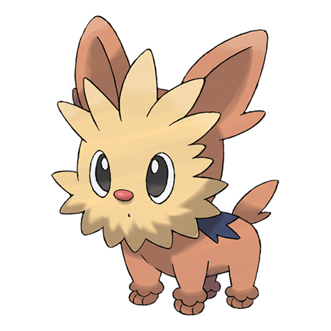

# Lillipup (#0506)

*Puppy Pokemon*

**Type:** Normale
**Abilities:** [[Vital Spirit]], [[Sand Rush]], [[Scrappy]] *(Hidden)*
**Base HP:** 3

> Good with children and old people, this gentle Pokemon is a favorite to keep as pet. It is very brave and smart and will protect it’s trainer against any threat. It uses the hair on its head to feel its surroundings.

---

## Statistiche (Attributes & Limits)

| Attribute | Base / Limit |
|---|---|
| **Strength** | 2/4 |
| **Dexterity** | 2/4 |
| **Vitality** | 2/4 |
| **Special** | 1/3 |
| **Insight** | 2/4 |

---

## Mosse (Learnset)

- **Starter:** [[Leer|Leer]], [[Tackle|Tackle]]
- **Beginner:** [[Odor_Sleuth|Odor Sleuth]], [[Bite|Bite]], [[Baby_Doll_Eyes|Baby-Doll Eyes]]
- **Amateur:** [[Helping_Hand|Helping Hand]], [[Take_Down|Take Down]], [[Work_Up|Work Up]], [[Crunch|Crunch]], [[Roar|Roar]], [[Retaliate|Retaliate]]
- **Ace:** [[Reversal|Reversal]], [[Last_Resort|Last Resort]], [[Giga_Impact|Giga Impact]], [[Play_Rough|Play Rough]]
- **Pro:** [[Lick|Lick]], [[Endure|Endure]], [[Yawn|Yawn]]

---

## Correlati

### Catena Evolutiva
- [[0506_Lillipup|Lillipup]]
- [[0507_Herdier|Herdier]]
- [[0508_Stoutland|Stoutland]]

